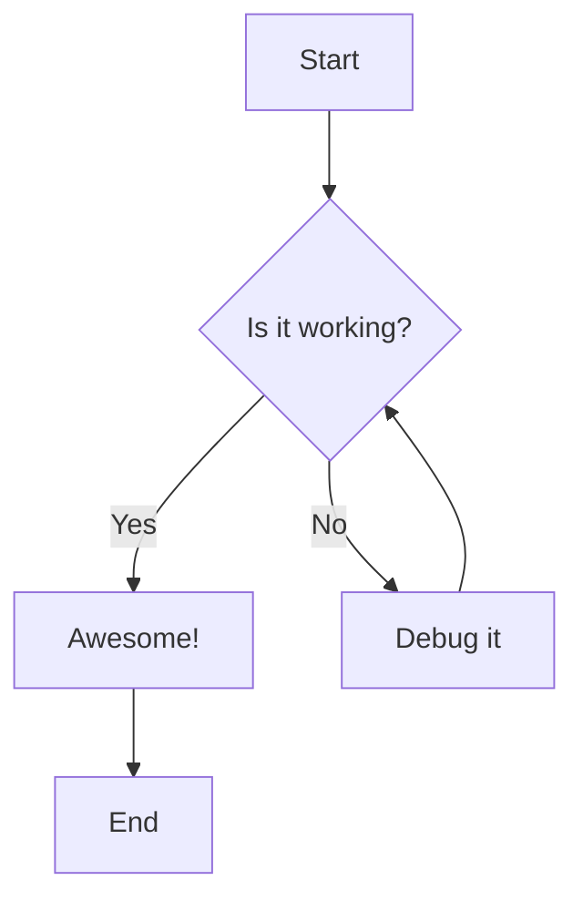

# Mermaid Viewer

A VSCode extension that gives you a powerful viewer for Mermaid diagrams with independent theme selection, appearance overrides, and export controls. Everything stays local-no accounts, Copilot prompts, or external services-while the dedicated preview surface (plus CodeLens buttons and gutter highlights) keeps multi- and single-diagram workflows fast.

## Features

- **Syntax Highlighting**: Full syntax highlighting for Mermaid diagrams in markdown code blocks and standalone .mmd/.mermaid files
- **Independent Theme Selection**: Choose from multiple Mermaid themes (default, dark, forest, neutral, base) directly in the preview panel
- **Optional VSCode Theme Sync**: Toggle option to automatically sync Mermaid theme with your VSCode theme (dark/light)
- **Live Preview**: Automatic preview updates as you edit your Mermaid diagrams
- **Rich Preview Toolbar**: Zoom, pan, reset, navigate between diagrams, and change the preview chrome (match VS Code, light, or dark) without leaving the panel
- **Keyboard Shortcuts**: Use `+`/`-` to zoom, `R` to reset, and arrow keys to pan around diagrams
- **Export Options**: Save any diagram as SVG, PNG (1x-4x), or JPG (1x-4x) right from the preview toolbar. Dimensions are displayed in the menu, so you know exactly what you're exporting
- **Copy to Clipboard**: Copy diagrams directly to your clipboard as SVG, PNG, or JPG for quick pasting into other apps
- **On-Document Shortcuts**: Click the CodeLens button or gutter icon on each Mermaid block (fenced `mermaid` blocks or `::: mermaid` containers) to open the preview (to the side) without leaving the editor
- **Side-by-Side View**: Open preview beside your editor for convenient editing
- **Theme Persistence**: Save your preferred theme as default
- **Multi-Diagram Support**: Preview every Mermaid block in a document and jump between them with the toolbar navigation controls
- **Offline Friendly**: Bundles Mermaid 11.12.2 locally, so previews work without a network connection or account
- **Copy Diagram Code**: Copy the raw Mermaid source from any block via CodeLens or command palette — useful for quickly reusing diagram code elsewhere
- **Copy with Wrapper**: Copy diagram code wrapped in a configurable template (e.g. `:::mermaid ... :::` for Azure DevOps) via right-click context menu, keyboard shortcut, or command palette

## Demo


## Usage

### Opening the Preview

1. Open a Markdown file containing Mermaid diagrams
2. Use one of these methods:
   - Click the preview icon in the editor title bar
   - Right-click in the editor and select "Mermaid Viewer: Open Preview"
   - Use Command Palette (`Cmd+Shift+P` / `Ctrl+Shift+P`) and search for "Mermaid Viewer: Open Preview"
   - For side-by-side view: "Mermaid Viewer: Open Preview to the Side"

### Changing Themes

In the preview panel toolbar:
- Use the **Theme** dropdown to select different themes
- Check **"Sync with VSCode theme"** to automatically match VSCode's theme
- Click **"Save as Default"** to persist your theme choice

### Previewing Individual Diagrams

- A **CodeLens button** labeled *Preview Diagram* appears above every Mermaid block in Markdown (fenced `mermaid` blocks and `::: mermaid` containers); clicking it opens a panel focused on that diagram.
- In standalone `.mmd`/`.mermaid` files, the CodeLens appears at the top so you can preview or copy quickly.
- A subtle **gutter icon** highlights Mermaid block starts in Markdown, so you can spot diagrams quickly (it's a visual cue only; use CodeLens to open preview).
- The editor toolbar/title icon still opens the multi-diagram preview, so you can see every Mermaid block at once.

### Copying Diagram Code

- **Copy** (`Preview | Copy` CodeLens): Copies the raw Mermaid source for the block, respecting the `copy.includeFrontMatter` setting for standalone files.
- **Copy with Wrapper**: Wraps the diagram code in the template configured in `mermaidLivePreview.copy.wrapper` before copying. Useful for pasting into platforms that require a specific syntax, such as Azure DevOps (`::: mermaid ... :::`).
  - Available via right-click context menu, command palette, or a custom keyboard shortcut.
  - If the code already contains the wrapper, it won't be applied twice.
  - Configure the wrapper in settings:
    ```json
    "mermaidLivePreview.copy.wrapper": ":::mermaid\n{{mermaid-code}}\n:::"
    ```


### Supported Themes

- **Default**: Classic Mermaid theme with clean, neutral colors
- **Dark**: Dark background with light elements
- **Forest**: Green-themed palette
- **Neutral**: Minimalist grayscale theme
- **Base**: Simple base theme

## Configuration

Configure the extension through VSCode settings:

```json
{
  // Default theme for Mermaid diagrams
  "mermaidLivePreview.theme": "default",

  // Automatically sync Mermaid theme with VSCode theme
  "mermaidLivePreview.useVSCodeTheme": false,

  // Automatically refresh preview on document changes
  "mermaidLivePreview.autoRefresh": true,

  // Delay in milliseconds before refreshing preview after changes
  "mermaidLivePreview.refreshDelay": 500,

  // Include frontmatter when copying from standalone .mmd/.mermaid files
  "mermaidLivePreview.copy.includeFrontMatter": true,

  // Template used when copying with wrapper. Use {{mermaid-code}} as the placeholder.
  // Example for Azure DevOps:
  "mermaidLivePreview.copy.wrapper": ":::mermaid\n{{mermaid-code}}\n:::"
}
```

## Example Mermaid Diagram

````

````
## Commands

- `Mermaid Viewer: Open Preview` - Shows Mermaid diagrams from the active Markdown or Mermaid file in the current editor column.
- `Mermaid Viewer: Open Preview to the Side` - Same preview behavior, but always opens in the column beside the editor for live editing.
- `Mermaid Viewer: Preview Diagram Here` - Focuses only the Mermaid block at the current cursor (or the CodeLens target) and keeps that single-diagram panel in sync while you type.
- `Mermaid Viewer: Copy` - Copies the raw Mermaid source code for the diagram at the current cursor position.
- `Mermaid Viewer: Copy with Wrapper` - Copies the diagram code wrapped in the template from `mermaidLivePreview.copy.wrapper`. Also available via right-click context menu.

## Requirements

- VSCode 1.85.0 or higher
- Markdown files with Mermaid code blocks (fenced `mermaid`) or ADO-style Mermaid containers (`::: mermaid ... :::`)
- Mermaid files (`.mmd`, `.mermaid`)

## Known Limitations

- Markdown preview supports Mermaid fenced blocks and ADO-style `::: mermaid` containers.
- ADO containers must be properly closed with `:::` to be extracted as a diagram.

## Extension Settings

This extension contributes the following settings:

* `mermaidLivePreview.theme`: Choose the default Mermaid theme
* `mermaidLivePreview.useVSCodeTheme`: Sync theme with VSCode
* `mermaidLivePreview.autoRefresh`: Enable/disable auto-refresh
* `mermaidLivePreview.refreshDelay`: Set refresh delay in milliseconds
* `mermaidLivePreview.copy.includeFrontMatter`: Include frontmatter when copying from standalone `.mmd`/`.mermaid` files (default: `true`)
* `mermaidLivePreview.copy.wrapper`: Template applied by "Copy with Wrapper". Use `{{mermaid-code}}` as the placeholder (default: `{{mermaid-code}}`)

## Contributing

Found a bug or have a feature request? Please open an issue!

## License

MIT - if you build on Mermaid Viewer, please keep the copyright notice intact and include attribution to Utkarsh Shigihalli in your distribution or documentation.
