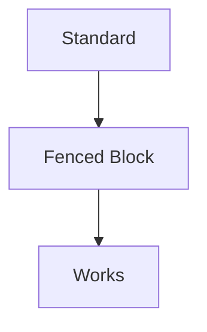
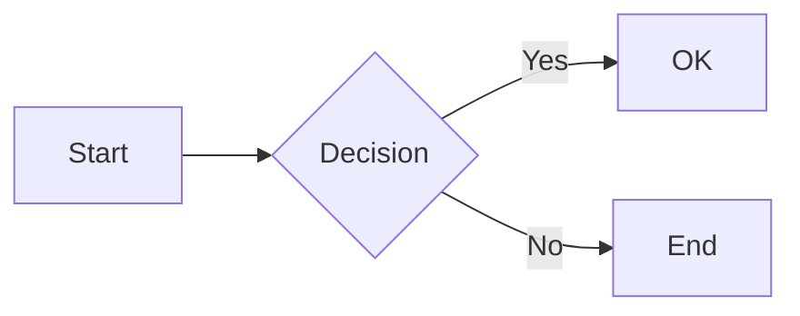

# Test ADO Syntax for Mermaid

## Standard Syntax (Fenced Code Block)

## Azure DevOps Syntax (Container)

:::mermaid
graph TD
    A[ADO] --> B[Container Syntax]
    B --> C[Should Work Too]
:::

## Azure DevOps Syntax (Container With Space)

::: mermaid
graph TD
    A[ADO] --> B[Container With Space]
    B --> C[Should Work Too]
:::

## Another ADO Example

:::mermaid
sequenceDiagram
    participant A as Alice
    participant B as Bob
    A->>B: Hello Bob!
    B->>A: Hello Alice!
:::

## Mixed Content

Regular text here.

:::mermaid
pie title Pets adopted by volunteers
    "Dogs" : 386
    "Cats" : 85
    "Rats" : 15
:::

More regular text.

