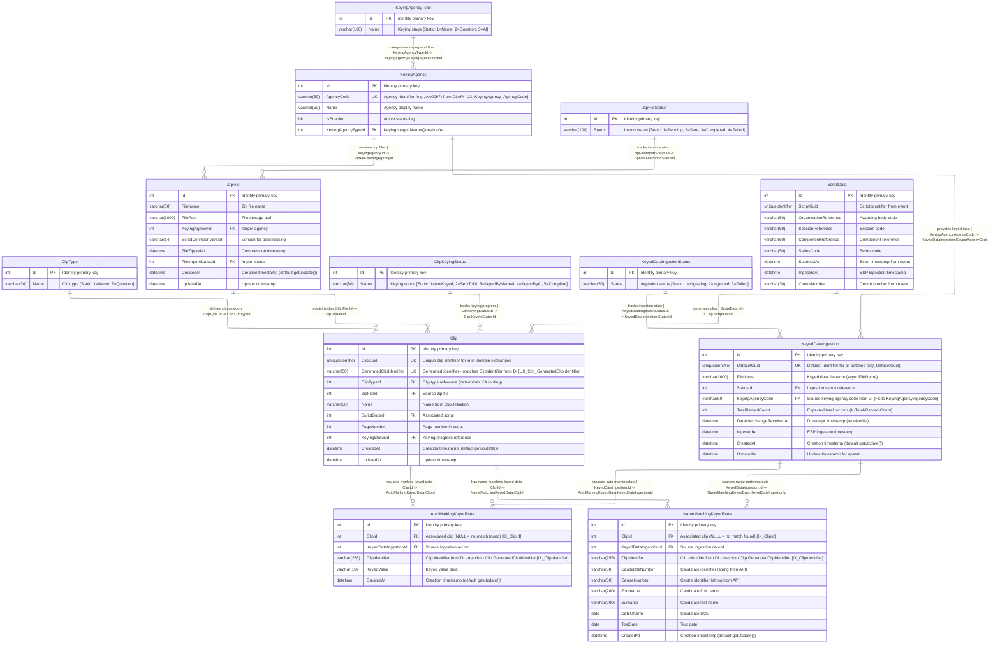
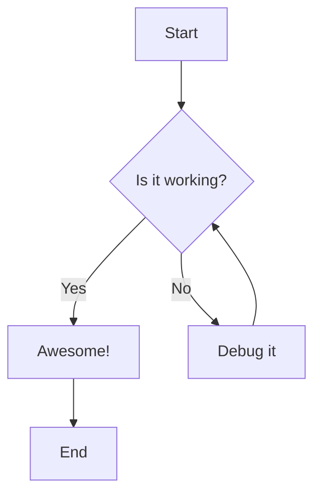
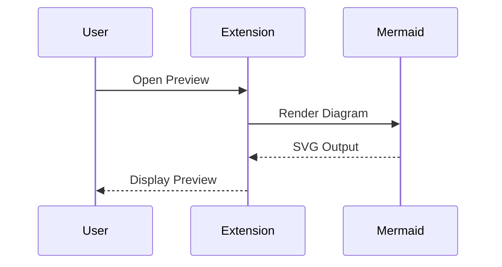
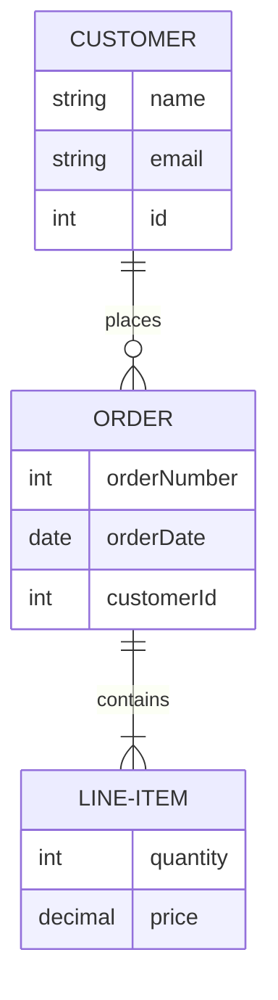
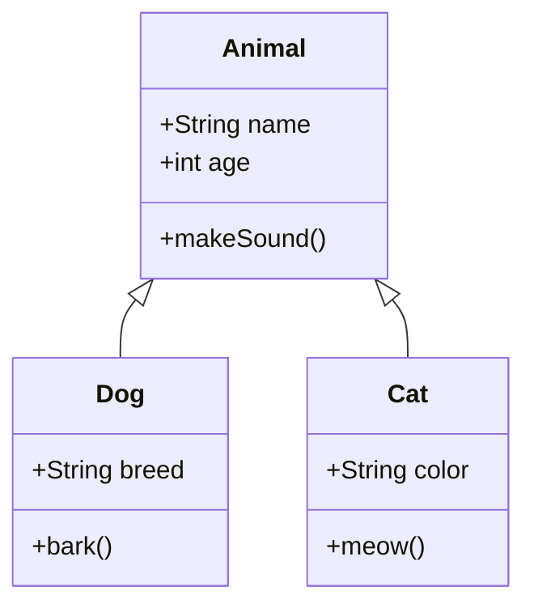
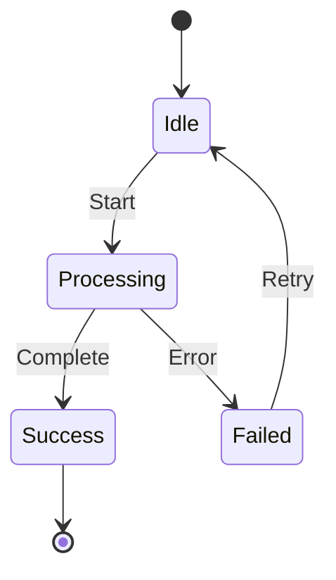
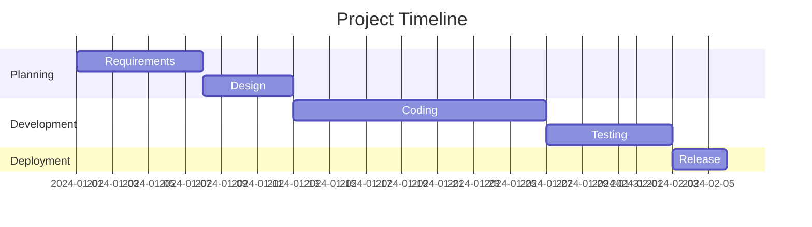

# Mermaid Preview Test File

Test the extension with these sample diagrams!

## Flowchart Example

## Sequence Diagram

## Entity Relationship Diagram

## Class Diagram

## State Diagram

## Gantt Chart

## Instructions

1. Open this file in VSCode
2. Press `Cmd+Shift+P` (Mac) or `Ctrl+Shift+P` (Windows/Linux)
3. Type "Mermaid: Open Preview to the Side"
4. Try changing themes in the preview toolbar!
5. Edit any diagram and watch it update live!
